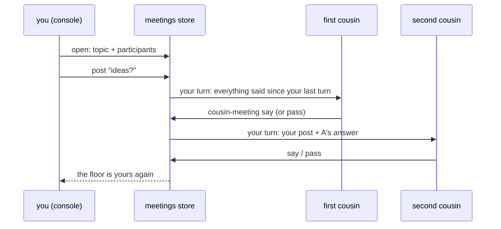

# Meetings

A meeting is a chat shared by you and several running [cousins](glossary.md#cousin): for
brainstorming, coordinating, or cross-reviewing a change. It runs in rounds,
so it stays a discussion instead of turning into five cousins answering at
once. Every cousin already knows what a meeting is and how to take part (see
[How cousins learn it](#how-cousins-learn-it)).

## How a meeting runs



- **Everyone is told.** When the meeting opens, each participant gets one
  line saying it is in the meeting, with whom, and to wait for its [turn](glossary.md#turn);
  when it closes, one line saying it is over. Neither needs an answer.
- **Participants** are running local cousins, in the order you pick them. A
  stopped cousin can't join: start it first. A remote cousin (on another
  machine) can't join yet.
- **Rounds.** Each post of yours starts a round: every participant speaks
  once, in order, and each one sees what the earlier ones said. After the
  last one the floor is yours. A cousin with nothing to add passes.
- **Asking one cousin.** A post that starts `@slug ` goes to that participant
  alone; after its answer the floor is yours again.
- **Out of turn** is refused, for you and for the cousins, with a message
  that says whose turn it is.
- **Silence.** A speaker that doesn't answer within the meeting's timeout
  (10 minutes by default), or whose session stops, is skipped by
  `cousin-loops` with a line in the transcript. You can also skip the
  current speaker yourself.
- **Speaking order.** Every turn line says which turn is yours ("2 of 3")
  and the whole order, with the current speaker marked; the opening line
  says where you speak in every round. The console shows the same
  numbered order above the [thread](glossary.md#thread).
- **Closing.** Without a facilitator the meeting closes at once. With one,
  the facilitator gets the whole transcript, writes the minutes (decisions,
  open questions, actions with an owner), adds each action to the tracker
  and posts the minutes; then the meeting closes.

A cousin is only woken on its own turn, with one message that carries
everything said since its last turn. A round with five participants costs
five turns.

## From the console

The **Meetings** page lists open meetings first, then closed ones. "New
meeting" takes a topic, the participants (a whole sidebar group, all running
cousins, or one by one; stopped and remote cousins are greyed out), an
optional facilitator and the timeout. Teams are simply your sidebar groups:
the framework keeps no team state, so regroup as often as you like.

The meeting view shows the transcript, the numbered speaking order, a banner
with whose turn it is, and a box to post in when the floor is yours. Skip and
Close are next to it; Delete removes a meeting and its transcript (a running
one tells its participants it is over). The
page follows the meeting live.

Your entries carry your console user name.

## From a shell

```
cousin-meeting open "name the new sensor" wren kestrel --facilitator kestrel --user ana
cousin-meeting post 3 "ideas?" --user ana
cousin-meeting post 3 "@wren what did you mean by a short name?" --user ana
cousin-meeting show 3
cousin-meeting skip 3 --user ana
cousin-meeting close 3 --user ana
cousin-meeting delete 3 --user ana
cousin-meeting list
```

A cousin speaks with `say`, `pass` and `minutes`. The speaker is the cousin
whose home `COUSIN_HOME` names:

```
cousin-meeting say 3 "Kestrel: short, and it's a bird like the rest"
cousin-meeting pass 3
cousin-meeting minutes 3 --stdin < minutes.md
```

The `meeting` MCP tool does the same (`say`, `pass`, `minutes`, `show`).

## What a cousin receives

```
(Meeting 3 "name the new sensor" round 1, your turn: 2 of 2; order 1 kestrel > 2 wren (now)): ana: ideas? | wren: Kestrel || Answer with: cousin-meeting say 3 "<text>" (or: cousin-meeting pass 3). One turn; stay on topic; be brief.
```

A direct question says `a direct question to you`; the facilitator's closing
turn says `closing, you facilitate` and carries the whole transcript.

## How cousins learn it

- New cousins get the **Meetings** section of
  `templates/cousin-CLAUDE.template.md` in their CLAUDE.md at spawn.
- Existing cousins get it from the template sync every start and [flip](glossary.md#flip) runs
  ([cousins](cousins.md#the-claudemd-template)), the `meeting` MCP tool
  included; the CLI works at once.
- Every turn message carries the how-to line itself.

## Where it lives

`<root>/data/meetings.db`, SQLite: `meetings` (topic, participants, state,
whose turn, round, timeout), `entries` (the transcript) and `seen` (what each
participant has been sent). The console is only a view of it: restarting the
console loses nothing, and `cousin-loops` keeps turns moving.

The design and its decisions: [meetings design](design/meetings.md).
